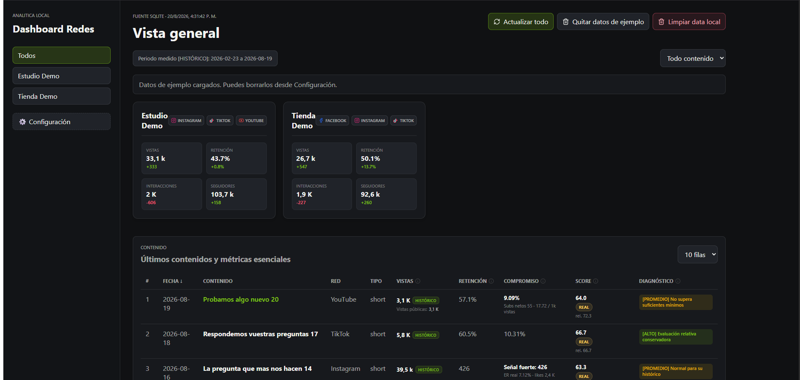
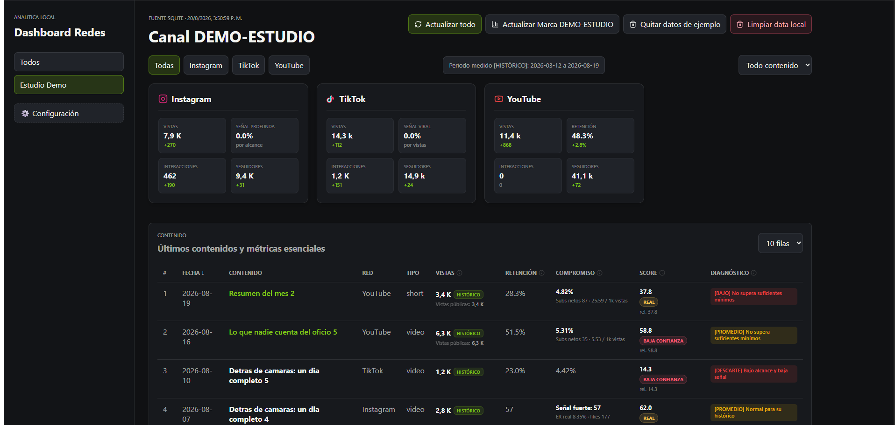
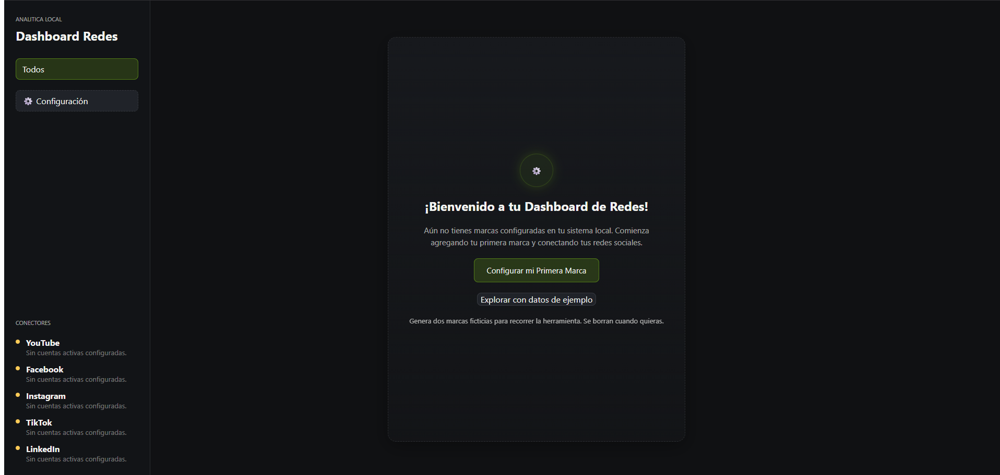

# Dashboard Redes

Dashboard local y autoalojado para consolidar métricas de **YouTube, Facebook, Instagram y TikTok**
en una sola pantalla, con un motor de scoring que evalúa cada publicación contra el histórico
del propio canal.

Todo corre en tu máquina. Las credenciales nunca salen de tu SQLite local.



La navegación tiene tres niveles: **todas las marcas → una marca → una red social concreta**.
Al bajar a una marca ves cada red por separado, con la métrica de señal que corresponde a esa
plataforma:



> Las cifras de ambas capturas provienen de los **datos de ejemplo** que incluye la herramienta:
> se cargan con un clic y sin configurar ninguna credencial.

---

## El problema que resuelve

Cada plataforma mide lo mismo de forma distinta, y comparar sus paneles nativos lleva a
conclusiones falsas:

- Una "vista" no significa lo mismo en TikTok que en YouTube o Instagram.
- Las ventanas temporales varían: 7 días, 28 días, histórico… según la plataforma y la pantalla.
- Las métricas de valor real (guardados, compartidos, retención) están dispersas en submenús
  y endpoints que exigen permisos avanzados.
- Un "me gusta" pasivo pesa lo mismo que un compartido en casi todos los rankings nativos.

Este proyecto homologa esas métricas bajo una temporalidad única (histórico / lifetime) y
pondera la interacción según su profundidad.

---

## Características

- **Ingesta multicanal**
  - *YouTube*: Data API v3 (métricas públicas inmediatas) + Analytics API vía OAuth 2.0
    (retención, tiempo de visualización, suscriptores netos)
  - *Meta*: Graph API v25.0 con tokens de página de larga duración y paginación por cursores
    para Facebook e Instagram
  - *TikTok*: ingesta de perfiles públicos mediante Apify (opcional, de pago)
  - *LinkedIn*: conector placeholder, degrada de forma segura
- **Navegación en tres niveles**: todas las marcas → una marca → una red social. Cada nivel
  agrega sus propios totales, y cada red muestra la métrica de señal que su plataforma permite
  calcular. Pensado para quien gestiona varias marcas con varias redes cada una.
- **Persistencia local en SQLite** como única fuente de verdad. Sin servicios externos.
- **Resiliencia por cuenta**: cada cuenta se procesa en un savepoint anidado; si una red falla,
  no interrumpe la sincronización de las demás.
- **Motor de scoring anti-falsos-positivos**, con tres mecanismos:
  - *Ponderación por profundidad de interacción:* `likes + comentarios×4 + compartidos×6 + guardados×8`.
    Un guardado indica más intención que un "me gusta", y el score lo refleja.
  - *Penalización por bajo alcance:* si el percentil de vistas de una publicación cae en el tercio
    inferior del histórico del canal (`< 35`), se aplica un factor `0.4` — **–60% al score**. Evita
    que una pieza con mucho engagement relativo pero poca exposición aparezca como sobresaliente.
  - *Rebalanceo sin retención:* cuando la plataforma no expone retención (Instagram, contenido
    estático, TikTok), los pesos se redistribuyen — engagement 50%, alcance 35%, conversión 15% —
    en lugar de puntuar sobre una métrica ausente.

  Cada publicación se evalúa contra el histórico de su propio canal y formato, y recibe un
  diagnóstico legible: `[ÉLITE]`, `[ALTO]`, `[ALTO RELATIVO]`, `[PROMEDIO]`, `[BAJO]`, `[DESCARTE]`.
- **Onboarding por interfaz**: marcas, cuentas y credenciales se dan de alta desde la web,
  con descubrimiento automático de páginas de Facebook y cuentas de Instagram vinculadas,
  resolución de canales de YouTube por handle o URL, y validación de credenciales en vivo.
  No hace falta editar archivos de configuración.
- **Reinicio controlado** (`POST /api/admin/reset-data`): borra métricas y contenidos ingeridos
  para repetir pruebas sin perder canales, cuentas ni credenciales.

---

## Stack

| Capa | Tecnologías |
| :--- | :--- |
| Backend | Python 3.11+, FastAPI, SQLAlchemy, SQLite, Uvicorn |
| Frontend | React 18, Vite, TypeScript, Recharts, TanStack Table |
| Ingesta | YouTube Data API v3, YouTube Analytics API, Meta Graph API, Apify |

---

## Requisitos

- **Python 3.11 o superior** — [python.org](https://www.python.org/downloads/).
  En Windows marca *«Add Python to PATH»* durante la instalación.
- **Node.js 18 o superior** — [nodejs.org](https://nodejs.org/), versión LTS.
- `pnpm` — el instalador de Windows lo pone por ti si no lo tienes.
- (Opcional) Credenciales de API — solo si quieres datos reales.

---

## Instalación

### Windows — dos clics

1. Descarga el repositorio (**Code → Download ZIP**) y descomprímelo, o clónalo.
2. Doble clic en **`instalar.bat`**. Comprueba que tengas Python y Node, instala `pnpm` si
   falta, crea un entorno virtual aislado y descarga todas las dependencias.
3. Doble clic en **`dashboard.bat`**. Abre la herramienta en el navegador.

Para cerrarlo todo, pulsa cualquier tecla en la ventana negra: apaga los dos servicios y
libera los puertos. Cerrar solo el navegador no los detiene.

`instalar.bat` se ejecuta una única vez. A partir de ahí solo necesitas `dashboard.bat`.

> No hace falta ninguna credencial para empezar. En la pantalla de bienvenida tienes
> **«Explorar con datos de ejemplo»**.

### Linux, macOS o instalación manual

```bash
git clone <URL-DEL-REPOSITORIO>
cd dashboard-redes
cp .env.example .env

python -m venv .venv
source .venv/bin/activate
pip install -r apps/backend/requirements.txt

cd apps/frontend && pnpm install
```

---

## Ejecución

**Windows** — doble clic en `dashboard.bat`.

**Manual (cualquier sistema)** — en dos terminales:
```bash
cd apps/backend && python -m app.main
```
```bash
cd apps/frontend && pnpm dev
```

| Servicio | URL |
| :--- | :--- |
| Interfaz web | `http://127.0.0.1:9511` |
| API | `http://127.0.0.1:9512/api/health` |
| Documentación de la API | `http://127.0.0.1:9512/docs` |

---

## Configuración

El archivo `.env` solo define host, puerto y modo:

```env
DASHBOARD_REDES_HOST=127.0.0.1
DASHBOARD_REDES_PORT=9512
DASHBOARD_REDES_MODE=live   # informativo; se reporta en /api/health
```

**Las credenciales de API no van aquí.** Se cargan desde la interfaz web, en el panel de
Configuración, y se guardan en la base SQLite local.

### Credenciales necesarias para el modo `live`

| Plataforma | Qué necesitas | Dónde se obtiene |
| :--- | :--- | :--- |
| YouTube (público) | API Key | Google Cloud Console → YouTube Data API v3 |
| YouTube (retención) | Client ID y Secret de OAuth 2.0 | Google Cloud Console → Credenciales OAuth |
| Facebook / Instagram | Token de usuario de larga duración | Meta for Developers → Graph API Explorer |
| TikTok | Token de Apify | apify.com — servicio de pago |

Instagram requiere una cuenta **profesional o de empresa** vinculada a una página de Facebook.

📖 **Guía paso a paso para cada plataforma: [docs/CREDENCIALES.md](docs/CREDENCIALES.md)**

---

## Estructura

```
apps/
  backend/          FastAPI + SQLAlchemy
    app/connectors/   Un módulo por plataforma
    app/services/     Sincronización, scoring, normalización
  frontend/         React + Vite
config/             Perfiles de KPI de ejemplo
scripts/utils/      Utilidades de diagnóstico
storage/            Base SQLite (generada, no versionada)
```

---

## Privacidad

- Todo se ejecuta en local. No hay telemetría ni servicios externos más allá de las APIs que tú configures.
- `.env`, `credentials/` y `storage/*.db` están excluidos del control de versiones.
- La base de datos con tus credenciales y métricas nunca sale de tu equipo.

---

## Datos de ejemplo



Si quieres recorrer la herramienta antes de conectar ninguna cuenta, pulsa
**«Explorar con datos de ejemplo»** en la pantalla de bienvenida. Genera dos marcas ficticias
con seis cuentas, 130 contenidos y dos meses de serie histórica, suficiente para ver el
ranking, el scoring y las gráficas funcionando.

No es un modo de ejecución: son filas normales en tu base local, marcadas con el prefijo
`DEMO-`. Conviven con tus datos reales y se eliminan con el botón **«Quitar datos de ejemplo»**
sin tocar nada más. El onboarding no cambia: si prefieres empezar por tus propias cuentas,
ignora el botón.

Desde la API:

```bash
curl -X POST http://127.0.0.1:9512/api/admin/demo-data     # cargar
curl -X DELETE http://127.0.0.1:9512/api/admin/demo-data   # eliminar
```

## Seguridad

- **Las credenciales se guardan en texto plano** en `storage/dashboard_redes.db`. El archivo
  está en `.gitignore` y nunca se publica, pero trátalo como un `.env`: quien lo tenga, tiene
  tus tokens.
- **La API no tiene autenticación.** Escucha en `127.0.0.1`, así que solo es accesible desde tu
  propio equipo. No cambies `DASHBOARD_REDES_HOST` a `0.0.0.0` sin poner un proxy con
  autenticación delante: expondrías tus datos y los endpoints de borrado a toda la red.
- Ninguna credencial se envía a otro sitio que no sea la API oficial de cada plataforma.

## Limitaciones conocidas

- El lanzador `dashboard.bat` es solo para Windows; en Linux y macOS se ejecuta manualmente.
- La YouTube Analytics API tiene un retraso de procesamiento de 48-72 horas.
- La ingesta de TikTok depende de Apify, que es un servicio de pago.
- El conector de LinkedIn es un placeholder sin implementar; está previsto para una versión
  futura, probablemente mediante scraping con Apify.
- `DASHBOARD_REDES_MODE` se reporta en `/api/health` pero no altera el comportamiento de los
  conectores. Para explorar la herramienta sin credenciales usa los datos de ejemplo.
- Los snapshots se guardan **uno por día**: sincronizar varias veces el mismo día actualiza
  el registro del día en lugar de crear uno nuevo. Se conservan 365 días por cuenta y 90 días
  por contenido; lo anterior se elimina en cada sync.
- **YouTube cambió su método de conteo de vistas el 2026-08-24.** Desde esa fecha los valores de
  `views` son más altos en vídeos largos. La herramienta guarda también `engagedViews`, que
  mantiene el criterio anterior, para poder comparar series históricas.

---

## Licencia

MIT — ver [LICENSE](LICENSE).
